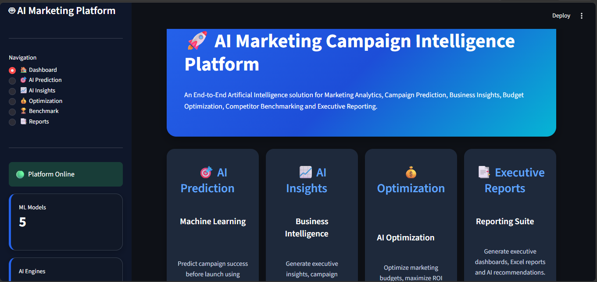
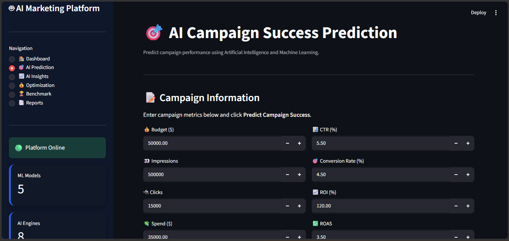
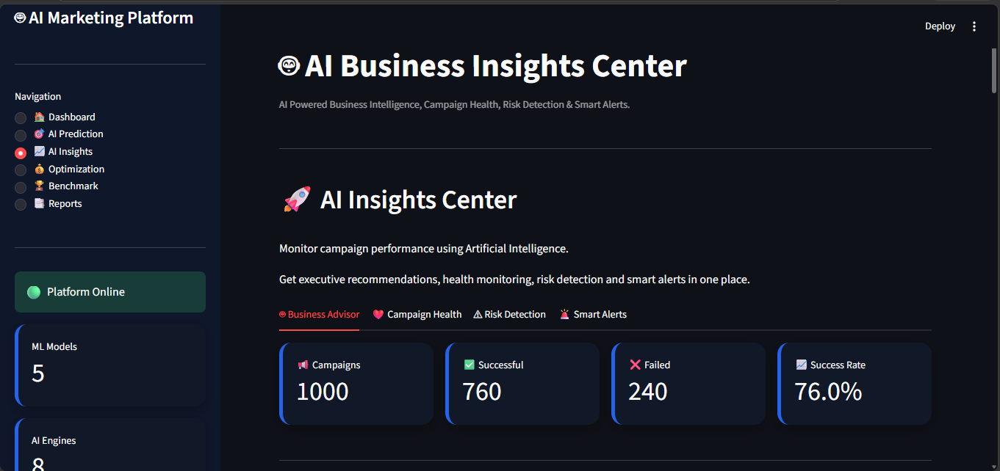
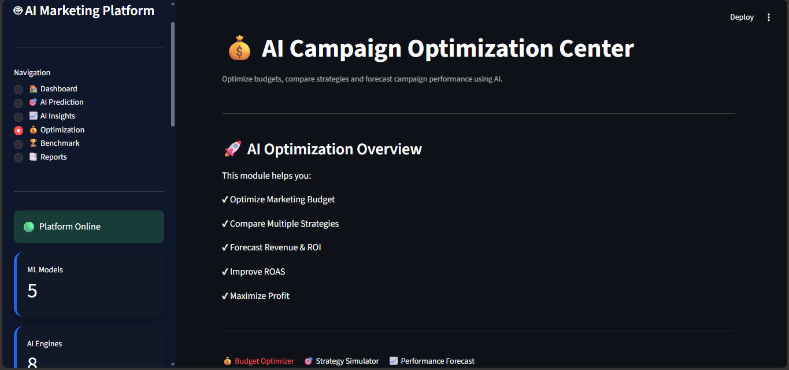
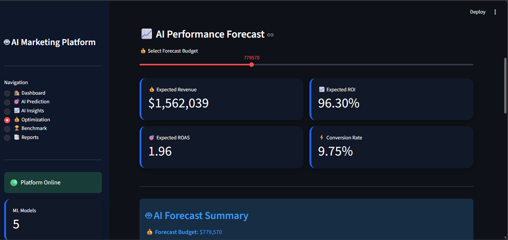
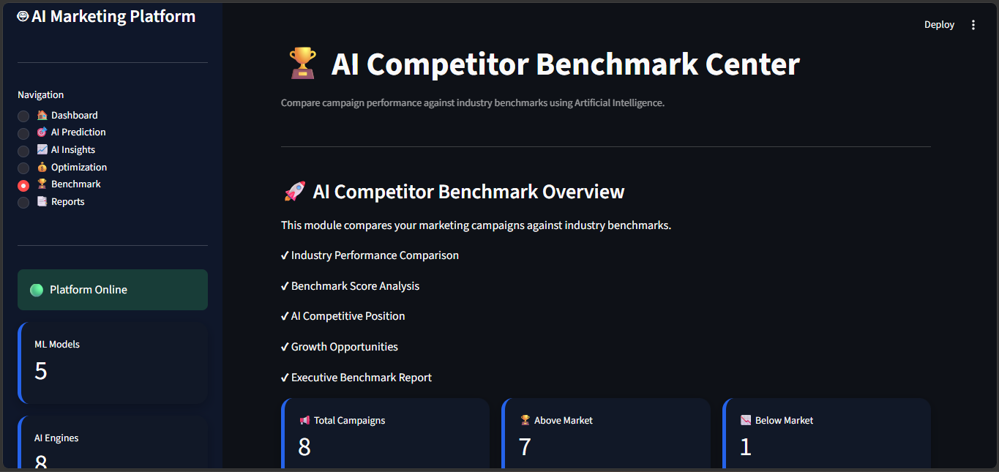
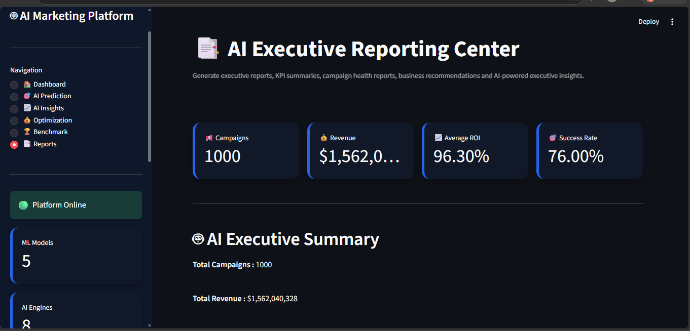

# 🚀 AI Marketing Campaign Intelligence Platform

## 📌 Project Overview

The AI Marketing Campaign Intelligence Platform is an end-to-end business intelligence solution designed to help marketing teams analyze campaign performance, predict future outcomes, identify business risks, and optimize marketing investments. Unlike traditional dashboards that only visualize historical data, this platform combines Machine Learning, AI-driven insights, and interactive analytics to support smarter business decisions.

---

# 🎯 Why This Project?

Most marketing dashboards only answer **"What happened?"**

This platform goes one step further by answering:

* Which campaigns are likely to succeed?
* Where is the marketing budget being wasted?
* Which channels generate the highest ROI?
* Which campaigns are risky?
* What business actions should be taken next?

It transforms raw marketing data into actionable business intelligence.

---

# 🛠️ Technology Stack

* Python
* Machine Learning (Scikit-Learn)
* Pandas & NumPy
* Streamlit
* SQL
* Power BI
* Joblib
* Matplotlib

---

# 📂 Project Workflow

Raw Marketing Data
⬇️

Data Cleaning & Preprocessing
⬇️

Feature Engineering
⬇️

Machine Learning Model Training
⬇️

AI Business Intelligence Engine
⬇️

Interactive Streamlit Dashboard

---

## 📊 Dashboard

---

The dashboard provides a complete overview of campaign performance through interactive visualizations and KPIs.

### Key Highlights

* Campaign Performance Summary
* ROI & ROAS Analysis
* Marketing Channel Performance
* Regional Performance
* Revenue Insights
* Executive KPIs

---

# 🤖 Campaign Success Prediction

---

The Machine Learning model predicts whether a campaign is likely to succeed based on multiple business factors.

### Features

* Success Prediction
* Feature Importance
* Classification Metrics
* Business-Oriented Results

Unlike simple prediction projects, this model is integrated directly into the business dashboard for real-time decision support.

---

# 🧠 AI Business Advisor

---

The AI Business Advisor automatically analyzes campaign data and generates business recommendations.

### It can identify:

* Budget efficiency
* Best performing channels
* High revenue regions
* ROI improvement opportunities
* Marketing recommendations

This removes the need for manual business analysis.

---

# 📈 Campaign Health Score

---

Every campaign receives an AI-generated health score based on its overall performance.

### Benefits

* Easy campaign monitoring
* Quick performance comparison
* Early performance evaluation

---

# ⚠️ Risk Detection

---

The platform identifies campaigns that may become unprofitable before significant losses occur.

### Risk Analysis Includes

* Low ROI campaigns
* Poor conversion campaigns
* Weak audience engagement
* Budget risk

---

# 💰 Budget Optimization

---

Instead of simply reporting spend, the platform suggests smarter budget allocation.

### Optimization Goals

* Maximize ROI
* Reduce unnecessary spending
* Improve marketing efficiency

---

# 📉 Performance Forecasting

---

Forecast future campaign performance using historical trends.

### Business Value

* Revenue estimation
* Future planning
* Marketing strategy preparation

---

# 🏆 Competitor Benchmark

---

Compare campaign performance against industry benchmarks.

### Helps Answer

* Are we performing above average?
* Which metrics need improvement?
* Where do competitors outperform us?

---

# 📄 Executive Reports

---

Automatically generated reports provide a quick business summary for decision-makers.

Includes:

* KPI Summary
* AI Recommendations
* Campaign Performance
* Business Insights

---

# ⭐ What Makes This Project Unique?

Unlike traditional marketing dashboards, this project combines:

* Machine Learning Predictions
* AI Business Recommendations
* Campaign Health Analysis
* Risk Detection
* Budget Optimization
* Performance Forecasting
* Interactive Business Dashboard

It is designed as a complete Marketing Intelligence Platform rather than just a visualization project.

---

# 📌 Business Impact

This platform helps organizations:

* Make data-driven marketing decisions
* Improve campaign performance
* Increase ROI
* Reduce marketing risks
* Optimize advertising budgets
* Save analysis time through AI-generated insights

---

# 🔗 Links

* **GitHub:** [https://github.com/palaktonke06-a11y/AI-Marketing-Campaign-Intelligence-Platform]

---

# 👩‍💻 Developed By

**Palak Tonke**

B.Tech Computer Science (Data Science)

Aspiring Data Scientist | Data Analyst | AI Enthusiast
